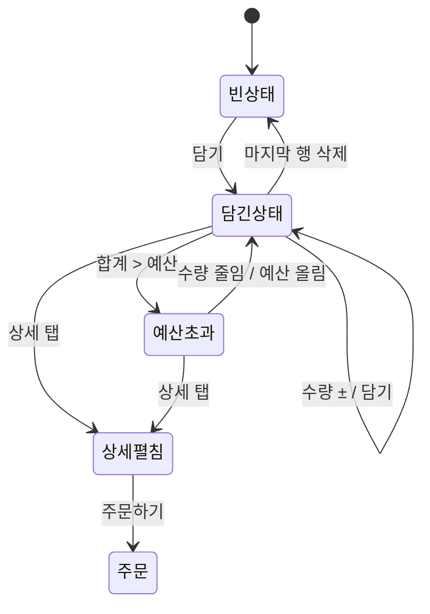
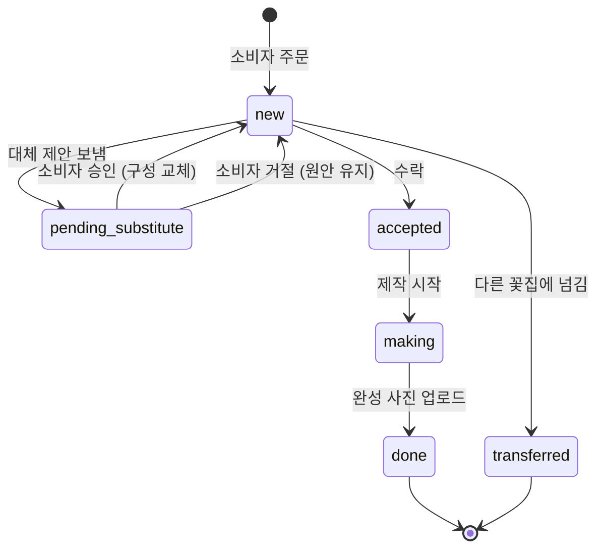
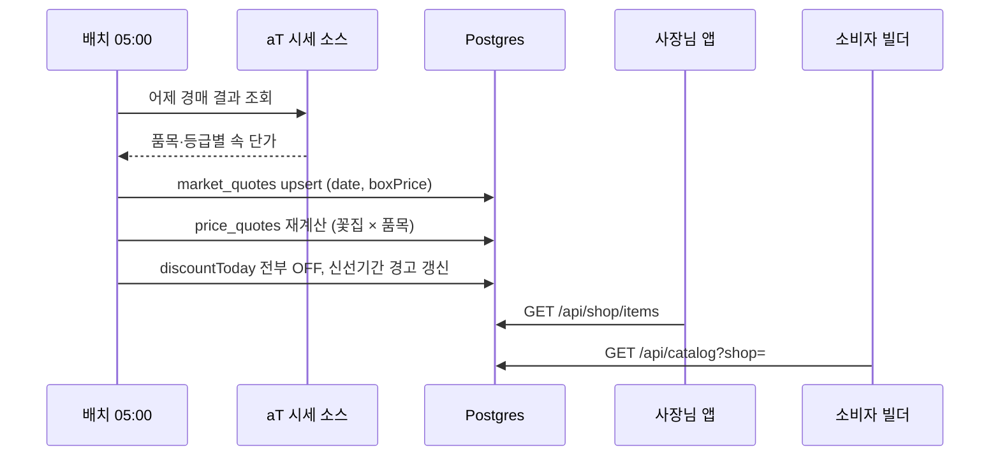

# 꽃다발 빌더 · 꽃집 운영 웹앱 — 개발 핸드오프

2026-09-18 · 장진우

> **결정 변경 (2026-09-18)** — 꽃집 간 재고 거래(아래 "5 근조 긴급"의 *근처 꽃집 재고 요청*·*다른 꽃집에 넘기기*, `/api/shop/urgent/:orderId/nearby`·`/request`, 미결 사항의 *제휴 꽃집 재고 공유*)는 **만들지 않는다.** 꽃집끼리 재고를 사고팔면 중간 유통 레이어가 하나 더 생기기 때문이다. 대신 **남는 재고(신선기간 2일 이하 − 주문에 묶인 수량)로만 꽃다발을 구성해 소비자에게 직접 할인 판매**한다. 구현 예: `landing/app.html`의 공급자 "재고·남는 꽃" / 소비자 "남는 꽃" 탭.

## 개요와 범위

네이티브 앱이 아니라 **웹앱 하나**로 만든다. 소비자용 꽃다발 빌더와 꽃집 사장님 운영 화면은 같은 코드베이스의 두 진입점이며, 사장님 화면은 홈 화면에 추가해 쓰는 PWA로 배포한다.

핵심 차별점은 aT 화훼공판장 경매 시세를 매일 05:00에 반영해 "오늘 시세 기준" 송이당 가격을 소비자와 사장님 양쪽에 같은 계산식으로 보여주는 것이다. 디자인 시안은 Design 캔버스 "꽃다발 빌더 · 꽃집 사장님 앱"의 아트보드 11개이며, 아래 표가 아트보드와 라우트의 대응이다.

| 아트보드 | 앱 | 라우트 | 해결하는 문제 |
| --- | --- | --- | --- |
| 빌더 · 빈 상태 / 담긴 상태 / 가격 상세 펼침 | 소비자 | `/builder` | 송이 단위 커스터마이징, 가격 투명성 |
| 1 오늘 | 사장님 | `/shop/today` | 새벽 발주 도박, 근조 긴급 |
| 2 주문 목록 / 주문 상세 | 사장님 | `/shop/orders`, `/shop/orders/:id` | 카톡 상담 30분, 완성 사진 노동 |
| 3 시세·품목 (모바일·태블릿) | 사장님 | `/shop/prices` | 가격 설명 불가, 신선기간 임박 재고 |
| 4 손님 / 손님 상세 | 사장님 | `/shop/customers`, `/shop/customers/:id` | 단골 인식 불가 |
| 5 근조 긴급 | 사장님 | `/shop/urgent/:orderId` (전체화면 오버레이) | 근조 주문 실패 비용 |

1차 범위에서 뺀 것: 결제(PG 연동), 실제 배송 추적, 소비자 회원가입 이후의 마이페이지, 제휴 꽃집 간 정산. 이들은 마지막 섹션의 미결 사항에 다시 적었다.

## 기술 전제 (웹앱)

모바일 브라우저를 1순위로 하는 반응형 웹앱이며, 브레이크포인트는 두 개만 둔다. 프레임워크는 정해진 것이 없으므로 아래는 제안이고, 이 문서의 나머지 내용은 프레임워크와 무관하다.

| 항목 | 결정 |
| --- | --- |
| 레이아웃 기준 | 모바일 390px 기준 설계, 컨텐츠 최대 폭 480px 중앙 정렬(데스크톱에서도 폰 폭 유지) |
| 브레이크포인트 | `min-width: 1024px` 하나. `/shop/prices`만 테이블+사이드패널 레이아웃으로 전환, 나머지는 480px 중앙 정렬 그대로 |
| 하단 탭바 / 하단 고정 바 | `position: sticky; bottom: 0` + `padding-bottom: env(safe-area-inset-bottom)` — 웹앱이므로 OS 탭바가 없고 직접 그린다 |
| 스와이프 삭제 | 터치 이벤트로 직접 구현(또는 가벼운 제스처 라이브러리). 마우스 환경을 위해 행 호버 시 "삭제" 버튼도 노출 |
| 사장님 앱 PWA | `manifest.json`(이름 "꽃집 운영", `display: standalone`, 시작 URL `/shop/today`) + 서비스워커로 셀 커버 캐시. 근조 알림은 Web Push(iOS는 홈화면 추가 후에만 가능) + 폴백으로 카카오 알림톡 |
| 완성 사진 | `<input type="file" accept="image/*" capture="environment">` — 모바일 브라우저에서 카메라가 바로 열린다. 클라이언트에서 1600px로 리사이즈 후 업로드 |
| 실시간 | 주문 들어오기·대체 제안 승인·근조 알림은 SSE 하나(`/api/shop/events`). 웹소켓 불필요 |
| 제안 스택 | Next.js(App Router) + TypeScript + Tailwind, DB는 Postgres(Supabase 또는 Neon), 이미지는 S3 호환 스토리지, Vercel 배포 |

라우트 구조는 소비자 `/builder`와 사장님 `/shop/*` 두 그룹이고, `/shop/*`는 사장님 로그인이 필요하다. 디자인의 세로로 긴 아트보드(900\~1600px)는 스크롤 전체를 펼쳐 그린 것이며, 실제로는 마지막 바만 고정되고 나머지는 세로 스크롤된다.

## 디자인 토큰

색은 크림 바탕 + 딥그린 하나이고, 경고는 주황, 근조 뱃지만 빨강이다. 아래 값을 CSS 변수(또는 Tailwind theme)로 그대로 옮긴다.

| 토큰 | 값 | 쓰임 |
| --- | --- | --- |
| `--bg` | `#F6F1E8` | 페이지 배경(크림) |
| `--card` | `#FFFDF9` | 카드·바 배경 |
| `--soft` | `#EFE9DE` | 읽기전용 셀, 세그먼트 트랙, 자이안트 시세 |
| `--line` | `#E6DED1` | 테두리, 구분선 |
| `--ink` | `#1E1B16` | 본문 글자 |
| `--muted` | `#6B655B` | 보조 글자(크림 위 대비 5:1 이상) |
| `--green` | `#1F5A3C` | 포인트: 주 버튼, 활성 탭, 편집 가능 셀 테두리, ▼하락 |
| `--green-tint` | `#E3EEE5` | 포인트 연한 배경(제철 뱃지, 가격 설명 박스) |
| `--orange` | `#B85A0C` | 경고: 예산 초과, 부족 수량, 오늘만 할인, 대체 제안 |
| `--orange-tint` | `#FBEBD9` | 경고 배경 |
| `--up` | `#C2382B` | ▲상승 (한국 관행: 오르면 빨강) |
| `--danger` | `#B3261E` / `#FAE3E0` | 근조 뱃지, 스와이프 삭제 배경 |

서체는 본문 **IBM Plex Sans KR**(400/500/600/700), 가격·수량·시각 같은 숫자는 전부 **IBM Plex Mono**(600/700) + `font-variant-numeric: tabular-nums`로 자릿수를 맞춘다. 숫자는 항상 우측 정렬, 천 단위 콤마(`toLocaleString('ko-KR')`), 단위(원/송이/%)는 숫자보다 한 단계 작게(숫자의 약 60%).

| 크기 | 값 |
| --- | --- |
| 화면 제목 / 카드 제목 / 본문 / 보조 | 22 / 15 / 14 / 12px |
| 큰 숫자(오늘 할 일, 시간 카운트다운) | 40\~52px, 근조 카운트다운 48px |
| 가격 숫자 | 카드 18px, 합계 20\~26px |
| 간격 | 4의 배수. 페이지 좌우 16px, 카드 내부 14\~16px, 카드 사이 10\~14px |
| 라운드 | 카드 14px, 버튼 10\~14px, 칩 999px, 바텀시트 22px |
| 터치 타깃 | 최소 44×44px. 주 버튼 52px, 근조 수락 60px, 카메라 64px(장갑 낀 손) |

등락은 항상 색과 화살표를 함께 쓴다: `▲8%`(--up) / `▼5%`(--green) / `—`(보조색). 읽기전용 값(시세)은 `--soft` 배경에 테두리 없음, 편집 가능 값(마진·재고)은 흰 배경에 `--green` 1.5px 테두리 — 이 두 스타일은 앱 전체에서 바꾸지 않는다. 이모지는 쓰지 않고 아이콘은 1.8px 스트로크 SVG(디자인에 쓴 것은 Lucide와 호환).

## 공통 컴포넌트

아래 12개를 먼저 만들면 11개 화면이 모두 조립된다. 모두 실제 `<button>` / `<a>` / `<input>`으로 만들고 아이콘만 있는 버튼에는 `aria-label`을 붙인다.

| 컴포넌트 | Props | 동작·규칙 |
| --- | --- | --- |
| `Money` | `value`, `size`, `unit='원'`, `tone` | Mono 숫자 + 작은 단위. 음수 없음. `tone=warn`이면 주황 |
| `Delta` | `pct` (양수/음수/null) | `▲n%` 빨강, `▼n%` 딥그린, null이면 `—` |
| `Chip` | `tone: season\|discount\|funeral\|soft`, `selected` | 필터 칩은 `aria-pressed`, 뱃지 칩은 정적 |
| `Switch` | `checked`, `onChange`, `size: sm\|lg` | 44×26 / 52×30. `role=switch` 버튼. 행 안에서 바로 토글(페이지 이동 없음) |
| `Stepper` | `value`, `min=0`, `max=재고`, `onChange` | −/+ 각 40×40. 재고 상한에서 + 비활성 + 토스트 "오늘 재고 n송이" |
| `SwipeRow` | `onDelete`, `children` | 왼쪽으로 84px 밀면 빨간 "삭제" 드러남, 더 밀면 삭제. 호버 시 삭제 버튼 노출 |
| `BudgetBar` | `budget`, `total`, `onBudgetChange` | 예산 · 합계 · 달성% 한 줄 + `<input type=range>`(1만\~15만, 5천 단위). 초과 시 합계와 %가 주황 |
| `FlowerCard` | `flower`, `quote`, `inCart`, `onAdd` | 사진 124px, 뱃지 좌상, 가격 행(오늘 · 가격 · /송이 · Delta), 44px 담기. 담긴 후에는 "담김 n" 상태로 바뀜 |
| `BouquetPreview` | `lines[]`, `delegate`, `onDelegateChange` | 빈 상태 안내 / 담긴 상태는 3D 뷰(three.js)에 꽃별 glTF 모델을 수량만큼 배치한다("3D 꽃다발 프리뷰" 섹션). WebGL 불가 환경은 2D 실루엣 폴백. 우측 상단 "플로리스트에게 배치 맡기기" Switch |
| `PriceBreakdown` | `flowers`, `materials`, `design`, `shipping`, `yesterdayFlowers` | 바텀시트. 4행 + 합계 + 예산 대비 바 + 시세 연동 문구 |
| `ReadonlyCell` / `EditCell` | `value`, (`onChange`) | 시세 vs 마진·재고. EditCell은 `inputmode=decimal` 40px, blur 또는 Enter에 저장, 입력 중에도 판매가 미리보기 갱신 |
| `PriceExplain` | `boxPrice`, `stemsPerBox`, `margin` | "시세 24,000원/속 ÷ 20송이 × 마진 2.8 = 3,360원" 문장 + "보여주기" 버튼(전체화면 큰 글씨 모달) |
| `ProblemCaption` | `text` | 각 사장님 화면 맨 위 36px 딥그린 띠. **프레젠테이션 전용** — `?demo=1` 쿼리가 있을 때만 렌더, 운영 배포에서는 숨김 |

사장님 앱 하단 탭바는 오늘 / 주문 / 시세 / 손님 / 더보기 5개, 활성 탭은 `aria-current=page` + 딥그린 + 굵은 글씨다. 주문 탭에는 미처리 근조 건수를 빨간 점으로 표시한다(디자인에는 없지만 필요).

## 데이터 모델과 가격 계산 규칙

모든 가격은 하나의 공식에서 나온다: **송이 판매가 = round10(속 단가 ÷ 속당 송이수 × 마진계수)**. 소비자 카드, 사장님 시세표, 가격 설명 문구가 같은 함수를 부른다. 예: 24,000 ÷ 20 × 2.8 = 3,360원 (10원 단위 반올림).

```ts
type Flower = { id: string; name: string; variety: string; grade: '특'|'상'|'보통';
  unit: '송이'|'줄기'; colors: string[]; inSeason: boolean; imageUrl?: string }

type MarketQuote = { flowerId: string; date: string; boxPrice: number;        // aT 속 단가 (읽기전용)
  stemsPerBox: number; prevBoxPrice: number | null }                         // 어제 속 단가

type ShopItem = { shopId: string; flowerId: string; active: boolean;        // 취급 토글
  margin: number; stock: number; freshUntil: string;                        // 편집 가능
  discountToday: boolean; discountPrice: number | null }

type PriceQuote = { flowerId: string; date: string; unitPrice: number;       // 계산 결과 (캐시)
  listPrice: number; deltaPct: number | null; badge: 'season'|'discount'|null }

type Bouquet = { lines: { flowerId: string; qty: number }[]; budget: number; delegateLayout: boolean }

type Order = { id: string; shopId: string; customerId: string;
  purpose: 'birthday'|'funeral'|'subscription'|'anniversary'|'other';
  bouquet: Bouquet; palette: string[]; cardMessage: string;
  deliverAt: string; deliveryType: 'delivery'|'pickup'; address?: string;
  status: 'new'|'pending_substitute'|'accepted'|'making'|'done'|'transferred';
  breakdown: Breakdown; substitute?: { from: string; to: string; approved: boolean | null } }

type Breakdown = { flowers: number; materials: number; design: number; shipping: number;
  total: number; yesterdayFlowers: number }

type Customer = { id: string; name: string; phone: string; firstOrderAt: string; orderCount: number;
  lifetimeSpend: number; events: { label: string; month: number; day: number }[];
  taste: { colors: string[]; avoid: { flower: string; reason: string }[]; mood: string[] } }
```

| 규칙 | 계산 |
| --- | --- |
| 송이 판매가 `listPrice` | `round10(boxPrice / stemsPerBox * margin)` |
| 오늘 가격 `unitPrice` | `discountToday ? discountPrice : listPrice`. 할인 켜면 기본값 `round100(listPrice × 0.7)`, 사장님이 수정 가능 |
| 어제 대비 `deltaPct` | `round((boxPrice - prevBoxPrice) / prevBoxPrice × 100)`. 시세 기준이지 판매가 기준이 아니다(마진 변경이 등락으로 보이면 안 됨). 어제 값 없으면 null → `—` |
| 꽃값 `flowers` | `Σ qty × unitPrice` |
| 부자재 `materials` | 꽃집 설정값. 기본 3,000원 |
| 디자인비 `design` | 꽃집 설정값. 기본 8,000원, 배치 맡김 여부와 무관(확인 필요 — 미결) |
| 배송비 `shipping` | 픽업 0, 배송은 꽃집 설정값(기본 3,000, 3만원 이상 0) |
| 시세 연동 문구 | `yesterdayFlowers = Σ qty × round10(prevBoxPrice / stemsPerBox × margin)` → "이 조합, 어제보다 ▲4%". 할인가는 어제 계산에 넣지 않음 |
| 발주 제안 부족분 | `need = 확정 + 예약(내일) + 구독(내일)`, `short = max(0, need - stock)`, 속 환산 `ceil(short / stemsPerBox)` |
| 신선기간 임박 | `freshUntil - today <= 2일` 이면 홈 경고 리스트에 노출, 1일 이하는 주황 |

샘플로 검산: 국화 10×1,200 + 리시안셔스 3×3,500 + 유칼립투스 2×1,800 = 26,100원, + 부자재 3,000 + 디자인비 8,000 + 배송 0 = **37,100원**. 같은 조합의 어제 꽃값은 25,000원이므로 문구는 "▲4%"가 된다(디자인 프롬프트의 "−6%"는 예시 문구였고 샘플 등락과 맞지 않아 계산값으로 바꿈).

## 화면 명세 — 소비자 꽃다발 빌더 (`/builder`)

한 페이지에 위에서 아래로 상단바 → 예산 바 → 프리뷰 → 담은 꽃 목록 → 카탈로그 순이고, 하단 고정 바는 항상 보인다. 빈 상태와 담긴 상태는 같은 페이지의 두 상태이고, 가격 상세는 바텀시트다. 장바구니는 `localStorage`에 두고 주문 시점에 서버로 보낸다.

| 영역 | 상태 / 동작 |
| --- | --- |
| 상단바 | 뒤로가기, "나만의 꽃다발", 우측 예산 아이콘 → 예산 바의 슬라이더에 포커스 |
| 예산 바 | 기본 예산 50,000원. 합계 > 예산이면 합계·%가 주황이 되고 하단 바 위에 "예산보다 n원 많아요" 한 줄 경고. 주문은 막지 않는다 |
| 프리뷰 (빈) | 점선 박스, "꽃을 담아보세요 / 아래에서 송이 단위로 고르면 여기에 쌓여요" |
| 프리뷰 (담김) | 3D 꽃다발: 꽃별 glTF 모델을 수량만큼 다발 슬롯에 배치(슬롯 순서 고정, 리렌더에 흔들리지 않게), 드래그로 회전, 하단에 "국화 10 · 리시안셔스 3 · 유칼립투스 2" 칩. 실제 배치가 아니라는 것을 문구로 알릴 필요는 없음 |
| 배치 맡기기 Switch | 켜면 `delegateLayout=true`, 주문서에 "플로리스트 맡김" 뱃지 |
| 담은 꽃 목록 | 행 = 이름 · 품종 · 송이당 가격 / Stepper / 소계. 0이 되면 행 제거. 스와이프 삭제 |
| 카탈로그 필터 | 전체 / 제철(`inSeason`) / 5천원 이하(`unitPrice <= 5000`) / 색상별(드롭다운: 화이트·레드·핑크·옐로우·그린). 필터는 URL 쿼리에 반영 |
| 카탈로그 카드 | 2열 그리드. 담기 → 장바구니 행 추가(qty 1) + 카드가 "담김 n"으로 바뀜 + 프리뷰에 실루엣 추가. 재고 0이면 "오늘 품절" 비활성 |
| 하단 바 | 합계 + "상세"(바텀시트 열기, `aria-expanded`) / "주문하기"는 장바구니가 비어 있으면 비활성 |
| 가곭 상세 바텀시트 | 꽃값(구성 요약) / 부자재 / 디자인비 / 배송비, 합계, 예산 대비 바, 시세 연동 문구 박스, 주문하기 버튼. 배경 탭이나 ESC로 닫힘 |

필터·장바구니·바텀시트의 상태 전이:



예산 초과는 경고일 뿐 주문을 막지 않고, "주문하기"는 장바구니가 비어 있을 때만 비활성이다.

## 3D 꽃다발 프리뷰 — Blender 파이프라인

프리뷰는 2D 실루엣이 아니라 3D로 구현한다. 꽃 모델은 Blender MCP로 기존 프리셋(에셋 라이브러리·무료 모델)에서 찾거나 직접 만들고, 웹에서는 three.js(react-three-fiber)로 띄운다. 디자인 캔버스의 실루엣 프리뷰는 레이아웃 자리표시이자 WebGL 폴백이다.

```mermaid
flowchart LR
    A[Blender MCP<br/>프리셋 탐색 / 직접 모델링] --> B[꽃 1종 = 1 glTF<br/>원점 = 줄기 밑]
    B --> C[gltf-transform<br/>Draco + WebP, 300KB 이하]
    C --> D[/public/models/*.glb]
    D --> E[BouquetPreview<br/>three.js 슬롯 배치]
    E --> F[주문서 썸네일<br/>canvas.toDataURL]
```

| 항목 | 규칙 |
| --- | --- |
| 모델 단위 | `Flower.id`당 glTF 하나(`mum-white.glb`, `rose-red.glb` …). 같은 품목의 색 변형은 메시 공유 + 머티리얼 색만 바꿈 |
| 좌표·스케일 | 원점 = 줄기 밑 끝, +Y = 위, 1 unit = 1m. 줄기 길이 약 0.35m, 꽃 머리 지름 국화 0.07 / 장미 0.06 / 리시안셔스 0.06 / 카네이션 0.05 / 튀립 0.05 / 유칼립투스 가지 0.30 |
| 폴리곤 예산 | 송이당 ≤ 3,000 tri, 텍스처 512px. 30송이 기준 모바일 60fps 목표. `InstancedMesh`로 같은 품목 반복 |
| 배치 | 다발 슬롯은 동심원 나선(안쪽부터 1, 6, 12, 18자리). `lines[]` 순서대로 채우되 유칼립투스 같은 그린은 바깥 링으로. 슬롯마다 고정 시드의 미세 회전·기울기 |
| 종이·리본 | 포장지는 크라프트 색 원뿔 메시 하나, 리본은 토러스 — "배치 맡김" 여부와 무관하게 항상 표시 |
| 조명·배경 | 환경맵 1개(실내 소프트), 배경은 `--card`와 같은 색, 그림자 없음. 카드 230px 안에 오브젠 카메라, 드래그 회전만(줌 없음) |
| 로딩 | 카탈로그 노출 품목만 프리패치. 로딩 중에는 같은 자리에 2D 실루엣 |
| 폴백 | WebGL 미지원·저사양이면 디자인의 2D 실루엣 프리뷰 그대로 |
| 사장님 주문 상세 | 소비자가 본 같은 3D 장면을 재현 + 주문 시점 `canvas.toDataURL` 썸네일을 주문서에 저장(알림톡·이력에 재사용) |

Blender 쪽 작업 순서: (1) 프리셋에서 국화·장미·리시안셔스·카네이션·튀립·유칼립투스 6종 확보, 없는 것은 직접 모델링 (2) 위 좌표·스케일로 정리하고 데시메이트 (3) glTF 2.0 익스포트(+Y up, 머티리얼 포함) (4) `gltf-transform optimize`로 압축 (5) `/dev/ui`에서 숫자를 바꿔 가며 배치 확인. 라이선스가 CC0 또는 상용 허용인 프리셋만 쓴다.

## 화면 명세 — 사장님 앱 (`/shop/*`)

모든 화면은 "이걸 보면 어떤 결정을 바로 하는가"로 설계되었고, 결정을 실행하는 버튼은 화면 이동 없이 그 자리에서 끝난다. 사장님 앱의 데이터는 진입 시 SSR로 내리고 이후 SSE로 갱신한다.

### 1 오늘 `/shop/today`

| 블록 | 데이터 | 결정 · 액션 |
| --- | --- | --- |
| 오늘 할 일 | 오늘 `deliverAt`인 주문 수, 근조 수 + 가장 이른 마감 시각, 내일 예약 발송 수, 일반·픽업 수 | "주문 보기" → `/shop/orders` |
| 내일 새벽 발주 제안 | 품목별 필요(확정+예약+구독 내역) / 재고 / 부족. 부족 > 0만 굵은 주황 | "발주 메모로 복사" → 클립보드에 `국화 백선 특 3속\n장미 레드나오미 상 1속` 형식 + 토스트 |
| 신선기간 임박 | `freshUntil` 2일 이하 품목: 남은 일, 수량, 할인가 | 행 안 Switch로 "오늘만 할인" 즉시 ON/OFF → `PATCH /api/shop/items/:id` |

### 2 주문 `/shop/orders`, `/shop/orders/:id`

| 블록 | 데이터 | 결정 · 액션 |
| --- | --- | --- |
| 세그먼트 | 오늘 / 예약 / 완료 (건수 포함) | 필터 |
| 주문 카드 | 용도 아이콘(생일·근조·구독·기념일), 손님·배송지, 배송 시각, 상태 칩, 예산, 구성 요약, 색감 스와치, 배치 맡김 여부, 카드 문구. 근조는 빨간 테두리 + 마감까지 남은 시간, 목록 최상단 고정 | 카드 탭 → 상세 |
| 상세: 프리뷰·정보 | 소비자 프리뷰(같은 `BouquetPreview`), 받는 분, 배송, 예산 vs 소비자 합계, 카드 문구 | 읽기 |
| 상세: 꽃 구성 · 재고 대조 | 행별 필요 수량 vs `stock`; 부족이면 주황 | "대체 제안 보내기": 같은 품목·다른 색·같은 등급 중 재고 있는 것을 기본 추천, 보내면 `status=pending_substitute` + "소비자 승인 대기" 표시 |
| 상세: 제작 완료 | 카메라 버튼 64px 하나 + 아래 세 갈래(손님 알림 / 포트폴리오 / 손님 이력) | 사진 1장 업로드 → `POST /api/shop/orders/:id/complete` 한 번이 세 가지를 같은 트랜잭션으로 처리. 성공 시 세 갈래에 체크가 순서대로 켜짐 |

### 3 시세 · 품목 `/shop/prices`

모바일은 품목당 카드 하나, 1024px 이상은 표 + 우측 패널(14일 차트, 가격 설명). 두 레이아웃은 같은 데이터와 같은 핸들러를 쓴다.

| 셀 | 종류 | 동작 |
| --- | --- | --- |
| 취급 | Switch | OFF면 행 전체 45% 투명 + 소비자 카탈로그에서 제외 |
| 품목·품종·등급 | 텍스트 버튼 | 탭하면 선택 → 차트와 가격 설명이 그 품목으로 바뀜 |
| 속 단가, 송이수/속 | ReadonlyCell | aT 시세. 회색 배경 |
| 마진계수 | EditCell (0.1 단위, 1.0\~6.0) | 입력 즉시 판매가·설명 문구 갱신(로컬), blur/Enter에 저장. 모바일은 편집 중 이전 판매가를 취소선으로 옆에 표시 |
| 송이 판매가 | 자동 | 할인 ON이면 할인가 주황 + 정가 취소선 |
| 어제 대비 | Delta | 시세 기준 |
| 재고 | EditCell (정수) | 저장 시 홈 발주 제안·주문 재고 대조에 반영 |
| 오늘만 할인 | Switch | ON 시 할인가 입력 노출(기본 70%) |
| 가격 설명 | PriceExplain | "보여주기" → 전체화면 모달(큰 글씨, 폰을 손님에게 돌려 보여주는 용도) |
| 14일 차트 | 선 차트 | 속 단가, x축 시작일·오늘, 최저/최고/오늘 세 값. 태블릿은 우측, 모바일은 목록 아래 |

### 4 손님 `/shop/customers`, `/shop/customers/:id`

| 블록 | 데이터 | 결정 · 액션 |
| --- | --- | --- |
| 이번 주 경조사 | `events` 중 오늘\~+7일인 손님 목록(이름 · 경조사 · 날짜) | "제안 보내기" → 지난 같은 경조사 구성을 오늘 시세로 재계산해 링크 발송 |
| 손님 목록 | 이름, 다가오는 경조사(없으면 "등록된 경조사 없음"), 마지막 주문일, 주문 횟수. 최근 주문순 | 행 탭 → 상세 |
| 상세: 다가오는 경조사 | 경조사, D-n, 작년 구성과 금액, 오늘 시세 재계산 금액 | "지난번 구성으로 제안 보내기" |
| 상세: 취향 프로필 | 선호 색감 스와치, 피하는 꽃(+이유), 분위기 칩 | 인라인 편집(탭하면 편집 모드) |
| 상세: 발송 이력 | 타임라인: 완성 사진 썸네일 · 용도 · 날짜 · 금액, 최신순 | 썸네일 탭 → 사진 크게 |

### 5 근조 긴급 `/shop/urgent/:orderId`

근조 주문이 들어오면 사장님이 어느 화면에 있든 전체화면 오버레이로 뜨고(SSE 이벤트 `order.funeral`), 앱이 닫혀 있으면 푸시·알림톡으로 이 URL을 보낸다.

| 블록 | 데이터 | 결정 · 액션 |
| --- | --- | --- |
| 검은 헤더 | 마감까지 카운트다운(초 단위, `hh:mm:ss`), 마감 시각, 배송지·거리·상품·금액 | 닫기(닫아도 주문 탭에 빨간 점 유지) |
| 필요 vs 재고 | 필요 국화 / 내 재고 / 부족(주황). 다른 품목은 한 줄 요약 | 읽기 |
| 근처 꽃집 재고 | 반경 3km 제휴 꽃집: 이름, 거리, 해당 품목 재고. 가까운 순 | "n송이 요청" 원탭 → 상대 꽃집에 알림, 버튼이 "요청함 · 응답 대기"로 바뀜 |
| 하단 두 버튼 | — | "수락 · 제작 시작"(60px) → `status=accepted` + 주문 상세로 / "다른 꽃집에 넘기기" → 가장 가까운 재고 충분 꽃집에 이관 제안, `status=transferred` |

## 상태·엣지케이스와 플로우

주문 하나의 상태는 여섯 개이고, 대체 제안과 근조 이관만 옆길로 빠진다.



일반 주문은 `new`에서 자동 `accepted`로 넘어가고, 근조만 사장님의 수락을 기다린다.

| 상황 | 동작 |
| --- | --- |
| 예산 초과(소비자) | 경고색만, 주문 허용. 주문서에는 예산과 합계를 둘 다 기록 |
| 재고보다 많이 담기 | Stepper +가 재고에서 멈춤, 토스트 "오늘 재고 n송이". 장바구니 복원 시 재고가 줄어들었으면 수량을 내리고 행에 표시 |
| 시세 갱신 중 장바구니 보유 | 장바구니는 `flowerId + qty`만 저장, 가격은 표시 시점에 다시 계산. 날짜가 바뀜 후 진입하면 "시세가 바뀌었어요: 26,100 → 26,800원" 배너 |
| 주문 시점 가격 고정 | 주문서의 `breakdown`과 항목별 `unitPrice`는 주문 시점 값으로 스냅샷. 이후 시세가 바뀌어도 주문서는 불변 |
| 대체 제안 소비자 응답 | 링크 페이지 `/orders/:id/substitute`(로그인 없이 토큰으로). 승인·거절 둘 다 SSE로 사장님 화면 갱신. 배송 2시간 전까지 무응답이면 사장님에게 "응답 없음 — 전화하기" 경고 |
| 완성 사진 업로드 실패 | 사진은 로컬에 보관, "다시 보내기". 세 가지 효과는 업로드 성공 후에만 실행(부분 성공 없음) |
| 근조 마감 경과 | 카운트다운 0이 되면 "마감 지남" 배지, 수락 버튼은 유지(사장님이 손님과 조율할 수 있음) |
| 제휴 꽃집 재고 요청 무응답 | 10분 후 버튼이 다시 활성화, "다른 꽃집에 넘기기"를 위로 올림 |
| 시세 갱신 실패(aT 미수신) | 어제 시세 유지, 가격 설명과 카탈로그에 "시세 기준 9/17" 표시, 등락은 `—` |
| 오늘만 할인 자정 | 할인 플래그는 매일 00:00에 자동 OFF. 신선기간이 남아 있으면 홈 경고 리스트에 다시 뜨며 한 번 더 켤 수 있음 |

## API 초안과 시세 갱신 배치

시세는 매일 05:00 KST에 한 번 받아 `market_quotes`에 날짜별로 쌓고, 그 자리에서 꽃집별 `price_quotes`를 미리 계산해 캐시한다. 사장님이 마진을 바꾸면 그 꽃집의 해당 품목만 다시 계산한다.



| Method | Path | 용도 |
| --- | --- | --- |
| GET | `/api/catalog?shop=&filter=` | 소비자 카탈로그: `Flower + PriceQuote + stock`, 취급 ON만 |
| POST | `/api/quote` | 장바구니 `lines[]` → `Breakdown`(서버 계산, 클라이언트 계산과 일치 검증) |
| POST | `/api/orders` | 주문 생성, 가격 스냅샷. 근조면 SSE `order.funeral` 발행 |
| GET/POST | `/api/orders/:id/substitute` | 소비자 대체 제안 조회 / 승인·거절 (토큰 인증) |
| GET | `/api/shop/today` | 홈 데이터 한 번에: 할 일 집계, 발주 제안, 임박 재고 |
| GET | `/api/shop/orders?tab=` | 주문 목록 |
| PATCH | `/api/shop/orders/:id` | `status`, 대체 제안 보내기(`substitute`) |
| POST | `/api/shop/orders/:id/complete` | multipart 사진 1장 → 알림 + 포트폴리오 + 손님 이력, 한 트랜잭션 |
| GET | `/api/shop/items` | 시세표: `ShopItem + MarketQuote + PriceQuote + hist14[]` |
| PATCH | `/api/shop/items/:flowerId` | `active`, `margin`, `stock`, `discountToday`, `discountPrice` — 응답에 재계산된 `PriceQuote` |
| GET | `/api/shop/customers`, `/:id` | 목록(이번 주 경조사 포함) / 상세 |
| POST | `/api/shop/customers/:id/propose` | 지난 구성으로 제안 발송 |
| GET | `/api/shop/urgent/:orderId/nearby` | 반경 3km 제휴 꽃집 재고 |
| POST | `/api/shop/urgent/:orderId/request` | 제휴 꽃집에 n송이 요청 |
| GET | `/api/shop/events` | SSE: `order.new`, `order.funeral`, `substitute.answered`, `stock.request.answered` |

aT 시세는 공공데이터포털의 화훼유통정보 API로 받는 것을 전제로 하되, 응답 필드명과 품종·등급 코드 매핑은 실제 키를 받은 뒤 확정해야 한다(미결 사항).

## 미결 사항과 구현 순서

아래 여섯 가지는 디자인이 가정으로 두고 있어 개발 전에 결정이 필요하다.

- [ ] aT 시세 소스 확정: 공공데이터 API 키 발급, 품종·등급 코드와 우리 `Flower` 매핑표
- [ ] 디자인비 8,000원을 "배치 맡김"에만 받을지, 항상 받을지
- [ ] 소비자 인증 방식(비회원 주문 + 전화번호 인증 또는 카카오 로그인)과 결제 PG
- [ ] 제휴 꽃집 재고 공유의 데이터 원천: 각 꽃집이 같은 앱을 쓰면 `ShopItem.stock`을 그대로, 아니면 수기 입력
- [ ] 구독 주문의 구성 결정 시점(매주 사장님이 직접 / 예산 안에서 자동 추천)
- [ ] 손님 알림 채널: 카카오 알림톡 비용 vs 문자 vs Web Push

구현은 가격 계산과 시세 배치를 먼저 세우고 그 위에 화면을 얹는 순서가 안전하다.

| 단계 | 범위 | 확인 기준 |
| --- | --- | --- |
| 1 | 스키마 + 가격 계산 함수 + 시세 배치(가짜 시세로) | 샘플 37,100원 및 ▲4%가 테스트로 재현 |
| 2 | 공통 컴포넌트 12개 + 토큰 | Storybook 또는 `/dev/ui` 페이지에서 디자인과 대조 |
| 3 | 소비자 빌더 3상태 + 주문 생성 | 폰에서 빈 상태 → 주문까지 끝남 |
| 4 | 사장님 시세·품목(모바일+태블릿) | 마진 수정이 소비자 카탈로그에 즉시 반영 |
| 5 | 오늘 + 주문 목록·상세 + 완성 사진 | 사진 1장으로 알림·포트폴리오·이력이 한 번에 생김 |
| 6 | 손님 + 근조 긴급 + SSE·푸시 + PWA | 근조 주문 시 앱이 닫혀 있어도 오버레이까지 도달 |

디자인 원본은 Design 캔버스 "꽃다발 빌더 · 꽃집 사장님 앱"이며, 캔버스에서 수정한 값이 있으면 이 문서의 토큰과 샘플을 따라 고친다.
